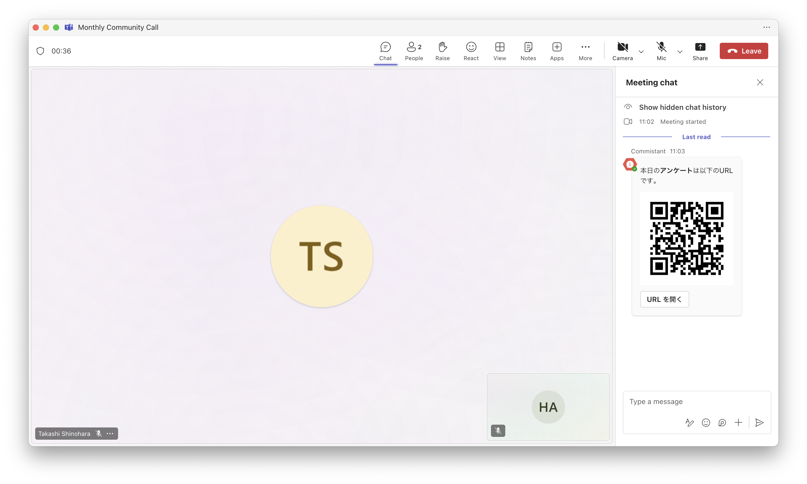
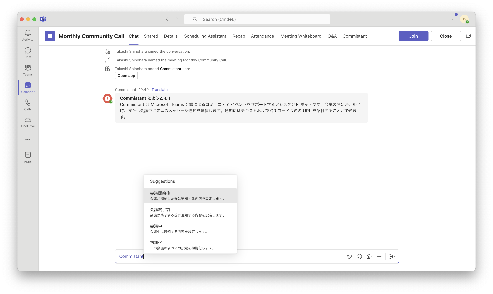
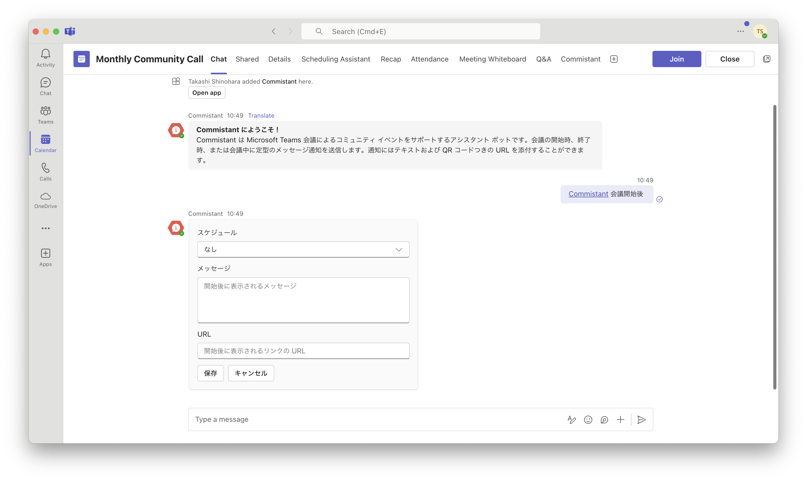
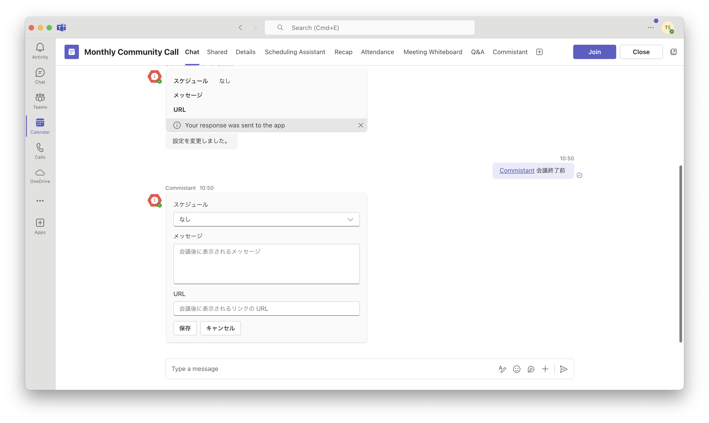
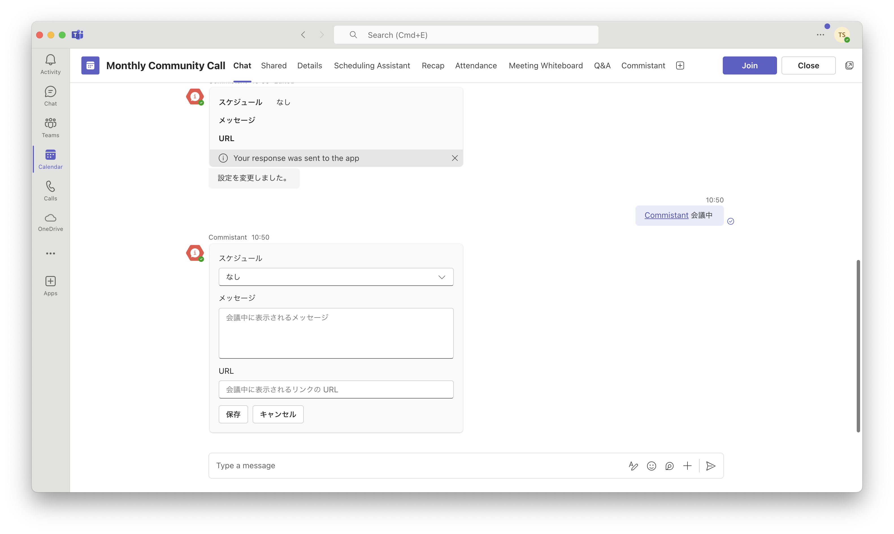
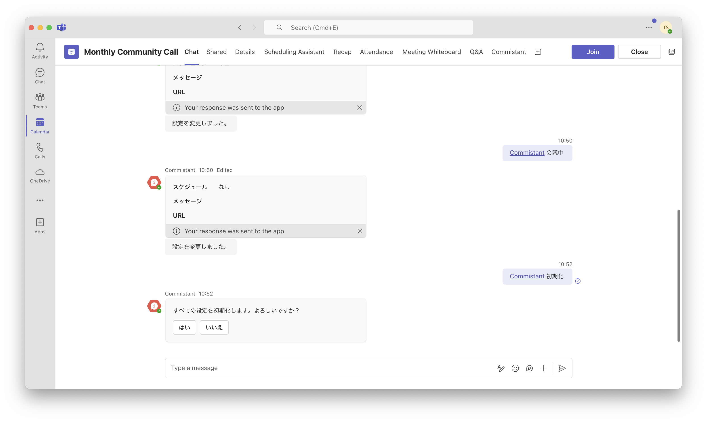
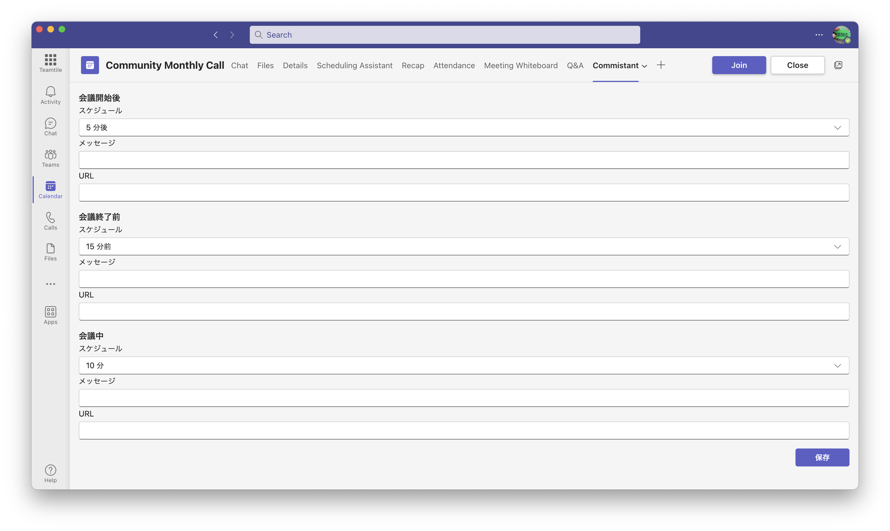

# Commistant

Commistant は Microsoft Teams 会議によるコミュニティ イベントをサポートするアシスタント ボットです。

## 機能

Commistant は会議の開始時、終了時、または会議中に定型のメッセージ通知を送信します。通知にはテキストおよび QR コードつきの URL を添付することができます。

## プレビュー

## 利用シーン

新型コロナウイルスの流行によりコミュニティ イベントはオンライン開催することが主流になりました。開催者は参加者に対して定型のメッセージを送ることがありますが、定期的にメッセージを送ることは開催者の負担となります。Commistant を使うことで、会議中に slido などの Q&A サービスに誘導することや、会議の最初や最後にアンケートの URL を送ることなどが簡単に実現できるようになります。

## 使用方法

### コマンドによる設定

事前に通知する内容を設定します。**@Commistant** と入力するとコマンドの一覧が表示されます。

|コマンド名|説明|
|-|-|
|会議開始後|会議が開始した後に通知する内容を設定します。|
|会議終了前|会議が終了する前に通知する内容を設定します。|
|会議中|会議中に通知する内容を設定します。|
|初期化|この会議のすべての設定を初期化します。|

#### 会議開始後

会議の開始時刻の後に 1 回だけ通知を送信します。

**@Commistant 会議開始後** と入力すると設定を変更できます。

|項目|内容|
|-|-|
|スケジュール|通知するタイミングを指定します。|
|メッセージ|送信するメッセージを指定します。|
|URL|送信する URL を指定します。|

スケジュールの選択肢は以下の通りです。

|項目|内容|
|-|-|
|なし|通知を送信しません。|
|予定時刻|スケジュールで設定されている開始時刻に送信します。|
|5 分後|スケジュールで設定されている開始時刻の 5 分後に送信します。|
|10 分後|スケジュールで設定されている開始時刻の 10 分後に送信します。|
|15 分後|スケジュールで設定されている開始時刻の 15 分後に送信します。|

#### 会議終了前

会議の終了時刻の前に 1 回だけ通知を送信します。

**@Commistant 会議終了前** と入力すると設定を変更できます。

|項目|内容|
|-|-|
|スケジュール|通知するタイミングを指定します。|
|メッセージ|送信するメッセージを指定します。|
|URL|送信する URL を指定します。|

スケジュールの選択肢は以下の通りです。

|項目|内容|
|-|-|
|なし|通知を送信しません。|
|予定時刻|スケジュールで設定されている終了時刻に送信します。|
|5 分後|スケジュールで設定されている終了時刻の 5 分前に送信します。|
|10 分後|スケジュールで設定されている終了時刻の 10 分前に送信します。|
|15 分後|スケジュールで設定されている終了時刻の 15 分前に送信します。|

#### 会議中

会議中に繰り返し通知を送信します。

**@Commistant 会議中** と入力すると設定を変更できます。

|項目|内容|
|-|-|
|スケジュール|通知するタイミングを指定します。|
|メッセージ|送信するメッセージを指定します。|
|URL|送信する URL を指定します。|

スケジュールの選択肢は以下の通りです。

|項目|内容|
|-|-|
|なし|通知を送信しません。|
|15 分|スケジュールで設定されている開始時刻から 15 分おきに送信します。|
|30 分|スケジュールで設定されている開始時刻から 30 分おきに送信します。|
|60 分|スケジュールで設定されている開始時刻から 60 分おきに送信します。|

#### 初期化

この会議のすべての設定を初期化します。

**@Commistant 初期化** と入力すると初期化できます。

### AI による設定

特定のコマンド以外でもチャットの内容を AI に理解させて設定を変更できます。いくつか例を示します。

- 会議開始後 5 分経ったら「こんにちは」と表示してください。
- 会議中 30 分おきに「アンケートにご協力ください」と表示してください。URL は「`https://www.example.com`」です。
- 設定をリセットしてください。

### タブによる設定

チャットによる設定変更のほかにタブを使用して設定を変更できます。

## 注意事項

- 設定は会議ごとに識別されます。複数日にわたるイベントで会議が別になる場合はそれぞれに設定してください。
- 参加者が途中で退出した場合は通知が参加者に表示されない場合があります。

# 素材

アプリで使用している素材は [unDraw](https://undraw.co/illustrations) にライセンスされています。
